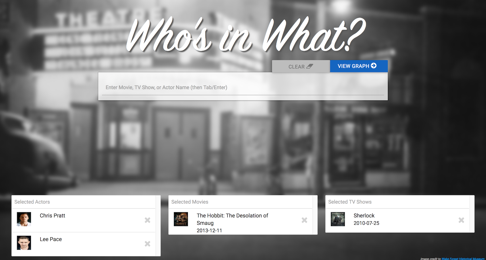
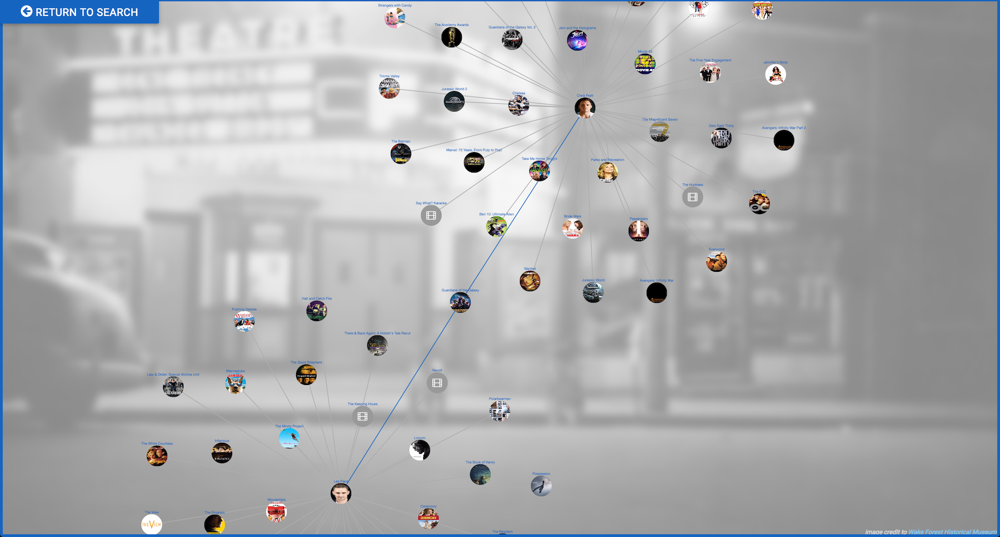

# whosInWhat

#### Search for actors, movies, or TV shows 



#### View graph to see what movies or TV shows actors have in common!  
    - Click actors to display movies / TV shows they've appeared in.
    - Click movies / TV shows to display its cast.
    


#### Running Locally

To run the app locally, you'll need to request an **API key** from themoviedb.org. (https://developers.themoviedb.org/3/getting-started/authentication).

 Create a `settings.json` file at the root of this project directory and paste the API key in, like below:  
 
 ```
{
    "apiKey": "REPLACE-WITH-API-KEY"
}
```